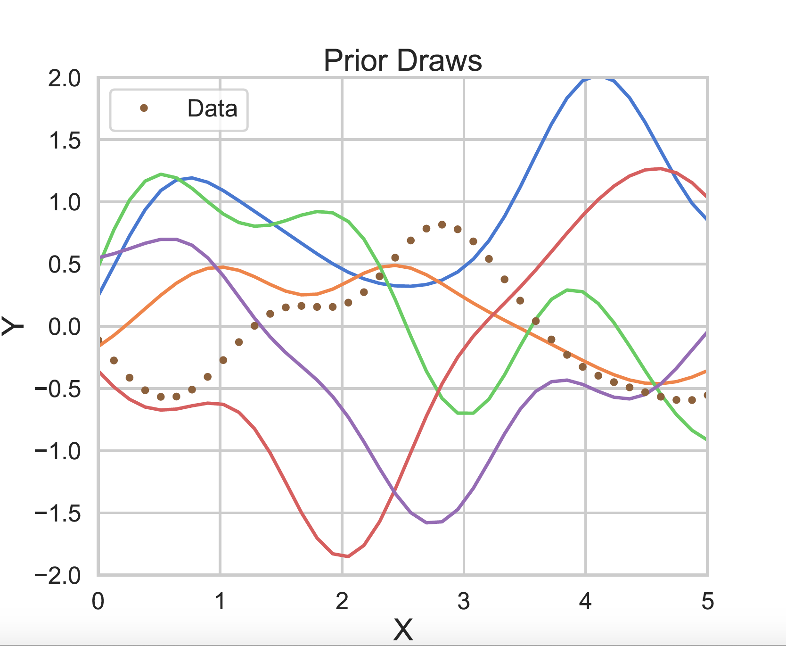
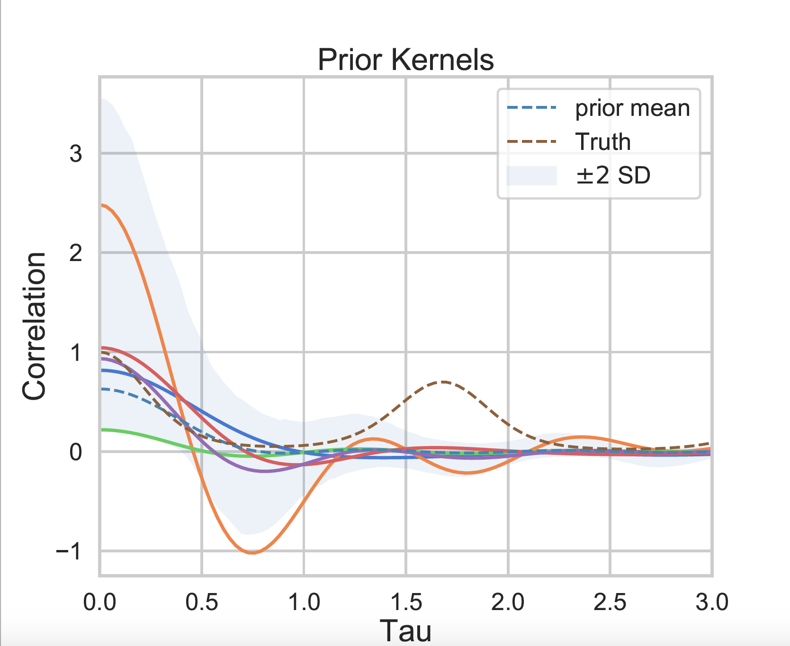
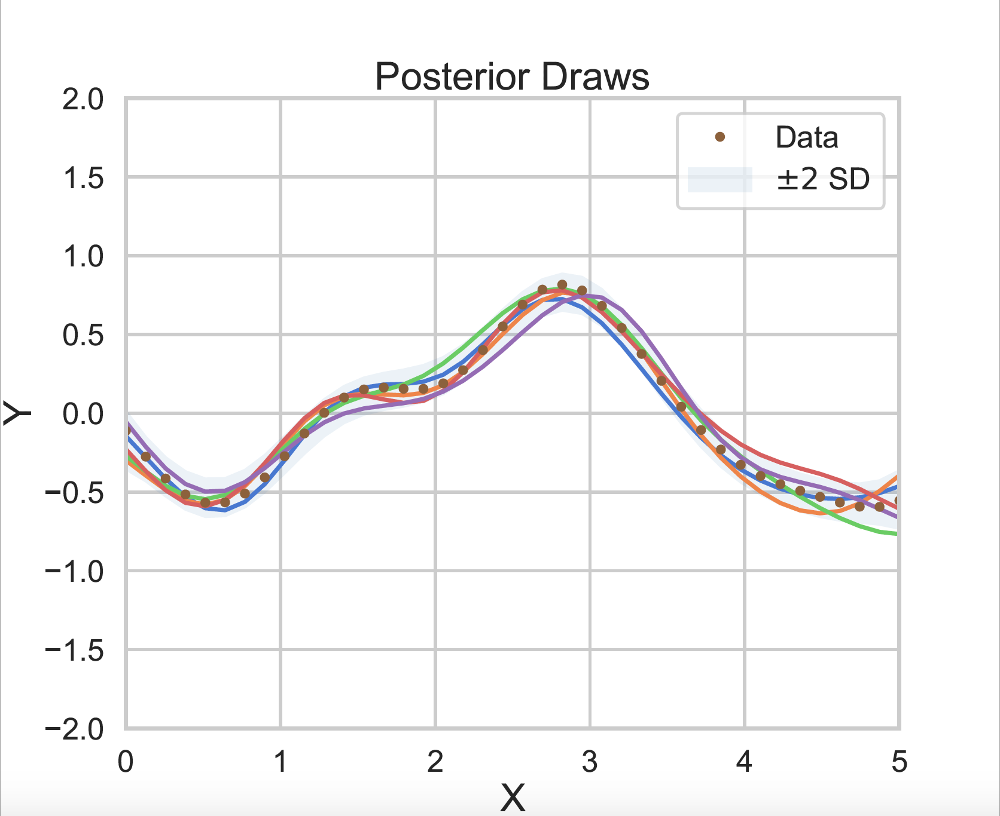
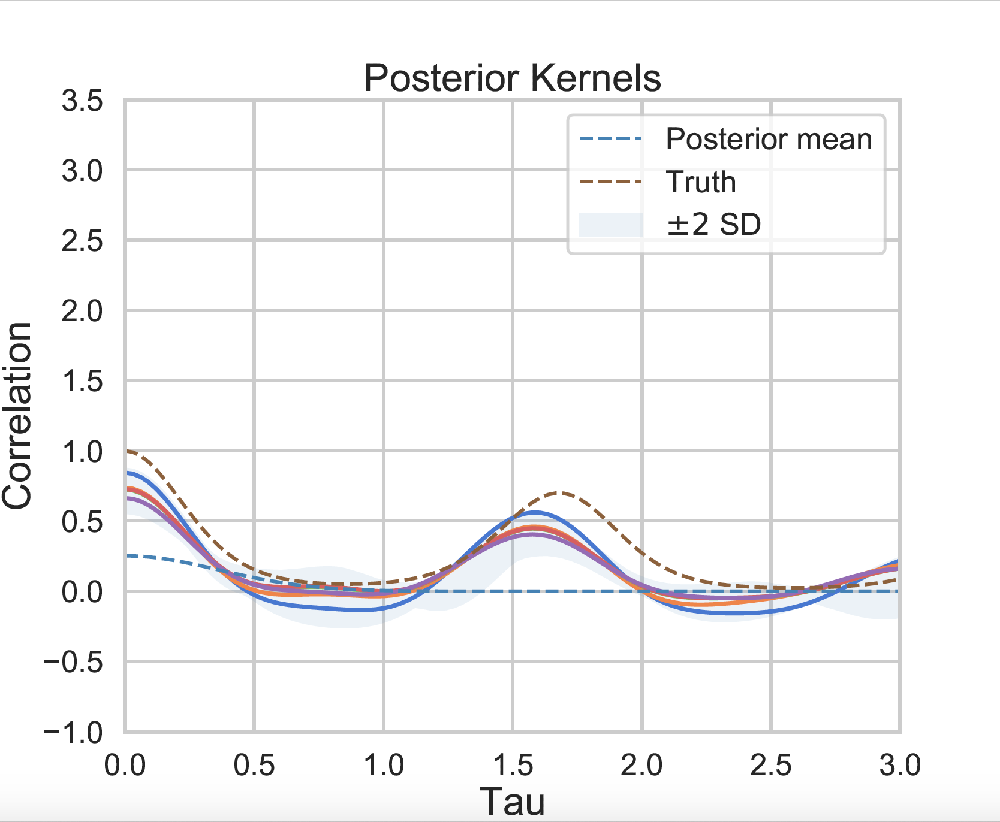

# Functional Kernel Learning (FKL)

This repository contains a GPyTorch implementation of functional kernel learning (FKL) from the paper,

[Function-Space Distributions over Kernels](http://papers.nips.cc/paper/9634-function-space-distributions-over-kernels)

by [Gregory Benton](https://g-benton.github.io/), [Wesley Maddox](https://wjmaddox.github.io), [Jayson Salkey](https://cs.nyu.edu/~jps777/), Julio Albinati, and [Andrew Gordon Wilson](https://cims.nyu.edu/~andrewgw/).

Please cite our work if you find it useful:
```
@inproceedings{benton_function-space_2019,
        title = {Function-space {Distributions} over {Kernels}},
        language = {en},
        booktitle = {Advances in {Neural} {Information} {Processing} {Systems}},
        author = {Benton, Greg and Salkey, Jayson and Maddox, Wesley and Albinati, Julio and Wilson, Andrew Gordon},
        year = {2019},
        pages = {8},
        }
```

## Introduction

Functional kernel learning is an extension of standard Gaussian process regression that directly models both
the data via a standard Gaussian process regression set-up, while also non-parametrically modelling kernel space.
To model the kernel in a non-parametric manner, FKL utilizes Bochner's Theorem to parameterize the kernel as a
deterministic function of its spectral density. FKL then model the spectral density as a latent Gaussian process,
performing alternating updates of elliptical slice sampling on the latent GP with gradient-based updates for the
GP regression hyper-parameters.

|     Prior, Function Space |   Prior, Kernel Space  |
:-------------------------:|:-------------------------:
 | 

|     Posterior, Function Space |   Posterior, Kernel Space  |
:-------------------------:|:-------------------------:
 | 

## Package

To install the package, run `python setup.py develop`.
See dependencies in `requirements.txt` (broadly latest versions of PyTorch (>=1.0.0), GPyTorch(>=0.3.2), and standard scipy/numpy builds.)

Please note that the codebase is written to use a GPU if it finds one. We also wrote everything to use double precision (even on the GPU) as default.

## One Dimensional Regression

This is in the `exps/` directory.

```
python regression_runner.py --data=SM --iters=1 --ess_iters=200 --nx=200 --omega_max=2 --optim_iters=8 #spectral mixture
python regression_runner.py --data=sinc --iters=5 --ess_iters=22 --optim_iters=5 --omega_max=1.3 --nx=100 --mean=LogRBF --nomg=75 #sinc
python regression_runner.py --data=QP --iters=5 --ess_iters=100 --nx=150 --omega_max=5 --period=1.7 --optim_iters=10 #quasi-periodic
python regression_runner.py --iters=5 --ess_iters=100 --optim_iters=10 --omega_max=8 #airline
```

## Multi-Dimensional Regression (with Product Kernels)

Multi-dimensional regression tasks can be found in the exps_multi_input_dim/ folder, one can use
regression_runner_prod_kernel.py and regression_runner_separate_latents_per_dim.py

To replicate our experiments, please run
```
bash exp_separate_latent_per_dim.sh
bash single_latent.sh
```
which will run on all datasets in Table 1.

## Multi-Task Extrapolation

This is found in the `prcp-testing/` and `fx/` folder.

The large scale precipitation dataset can be found at: https://www.dropbox.com/sh/004x3em6oskjue3/AADl4beuZJPBMqckGtW430e9a?dl=0 (hopefully anonymous).
This is a pre-processed version. Drop it into the prcp-testing/data-management/ folder and then run.

```
python r_to_np_data.py
```

before training.

### Training command for Precipitation Data

```
python run_extrapolation.py --iters=10 --ess_iters=10 --optim_iters=20 --save=TRUE #if saving models
```

Note that this will save all of the plots to: `plots/run108_0523_final/`

### Training command for FX dataset

```
python runner.py --dataset=fx
```

### References

[PyTorch](https://pytorch.org) and [GPyTorch](https://gpytorch.ai) for automatic differentiation and the modelling set-up.

We additionally compared to standard GPyTorch GP models (see [example](https://github.com/cornellius-gp/gpytorch/blob/master/examples/01_Simple_GP_Regression/Simple_GP_Regression.ipynb)).

Finally, the `bnse` file contains a clone of Felipe Tobar's Bayesian nonparametric spectral estimation code from [here](https://github.com/GAMES-UChile/BayesianSpectralEstimation).
